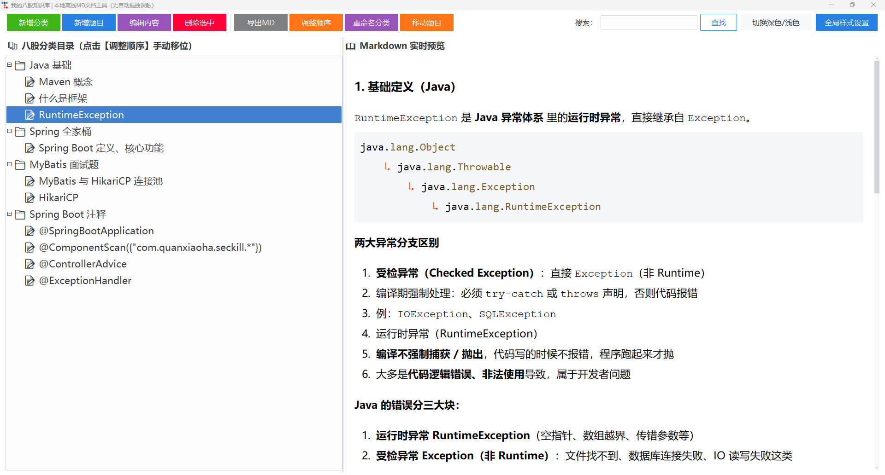

# 📚 八股知识库 — Bagu Knowledge Base

一个 **本地离线、纯 Markdown 驱动** 的面试题管理工具，专为程序员打造，帮你轻松整理、查阅和复习各类“八股文”知识点。  
支持 **多分类 / 多题目**、**实时预览**、**全屏编辑**、**深色模式**、**全局字体调节** 和 **自动更新**。



---

## ✨ 核心功能

- 📂 **分类管理** — 无限层级分类，支持 **新增、重命名、删除、手动排序**  
- 📝 **题目管理** — 每个分类下可添加多道题目，支持 **新增、编辑（Markdown）、删除、移动（跨分类）**  
- 👁️ **实时预览** — 右侧面板即时渲染 Markdown，支持代码高亮、表格、图片（本地 assets 自动引用）  
- 🎨 **主题切换** — 一键切换 **浅色/深色** 主题，保护眼睛  
- 🔍 **全文搜索** — 实时搜索题目 **标题和内容**，快速定位  
- ⚙️ **全局样式定制** — 独立调节 **UI 字体、目录树字体、预览标题/正文/行间距/边距、编辑器字体**，永久保存  
- 🖼️ **图片插入** — 编辑时一键插入 **大图（700px）** 或 **小图（450px）**，自动复制到 `assets/` 目录  
- 📤 **导出单题 MD** — 将当前题目导出为独立 Markdown 文件  
- 🔄 **跨分类移动** — 轻松将题目从一个分类移动到另一个分类  
- 🚀 **自动更新** — 启动时检测远端新版本，支持 **后台下载 + 静默替换**，用户体验无缝升级  
- 💾 **数据存储** — 源码运行时保存在程序目录，打包 EXE 后自动迁移至 **用户目录**（`%APPDATA%` / `~/Library/Application Support`），卸载时无残留

---

## 🖥️ 运行环境

- Windows / macOS / Linux（Python 3.7+）
- 打包为独立 EXE（Windows）后无需安装 Python，单文件运行

---

## 📦 安装与运行

### 源码运行

1. 克隆仓库：
   ```bash
   git clone https://github.com/wenzhouce/bagu_reader.git
   cd bagu_reader
   ```
2. 安装依赖：
   ```bash
   pip install -r requirements.txt
   ```
3. 启动：
   ```bash
   python main.py
   ```

### 打包为 EXE（Windows）

使用 PyInstaller 打包为单文件：

```bash
pip install pyinstaller
pyinstaller -F -w --add-data "assets;assets" main.py --name bagu_reader
```

> 打包后生成的 `bagu_reader.exe` 可独立运行，数据自动存储到用户目录。

---

## 📁 数据存储位置

| 运行模式            | 数据目录                                                     |
| ------------------- | ------------------------------------------------------------ |
| 源码（.py）         | 程序所在目录（`./bagu_db.json`, `./assets/`, `./config.json`） |
| 打包 EXE（Windows） | `%APPDATA%\bagu_knowledge`                                   |
| 打包 EXE（macOS）   | `~/Library/Application Support/bagu_knowledge`               |
| 打包 EXE（Linux）   | `~/.config/bagu_knowledge`                                   |

> 卸载时直接删除上述目录即可清除所有数据。

---

## 🧩 主要依赖

- `ttkbootstrap` — 美观的 Bootstarp 主题 Tkinter 扩展
- `tkinterweb` — 轻量级 HTML 预览控件（支持 CSS）
- `markdown` + `pygments` — Markdown 解析与代码高亮
- `Pillow` — 图片处理（预留，当前仅用于格式检查）

完整依赖见 `requirements.txt`：

```
ttkbootstrap
tkinterweb
markdown
pygments
Pillow
```

---

## 🛠️ 使用指南

### 1. 分类操作
- **新增分类**：点击顶部「新增分类」，输入分类名称  
- **重命名分类**：选中分类，点击「重命名分类」  
- **删除分类**：选中分类，点击「删除选中」（会同时删除其下所有题目）  
- **调整顺序**：选中分类，点击「调整顺序」，在弹出窗口中上下移动

### 2. 题目操作
- **新增题目**：先选中一个分类，点击「新增题目」，输入标题（内容会填充默认模板）  
- **编辑内容**：选中题目，点击「编辑内容」，在弹窗中编写 Markdown  
  - 支持 `Ctrl+Z` 撤销 / `Ctrl+Y` 重做  
  - 点击「插入大图」或「插入小图」自动导入图片并生成正确引用  
  - 点击「插入 &nbsp;」快速插入不间断空格（用于保留多个连续空格）  
- **移动题目**：选中题目，点击「移动题目」，输入目标分类序号  
- **删除题目**：选中题目，点击「删除选中」  
- **导出 MD**：选中题目，点击「导出MD」，保存为 `.md` 文件

### 3. 搜索
在右上角搜索框输入关键词，按回车或点击「查找」，树形目录会**仅显示匹配的题目**（同时匹配标题和正文）。

### 4. 样式定制
点击右上角「全局样式设置」，可独立调节：
- 顶部按钮/搜索框字体大小
- 左侧目录树字体大小
- 预览标题（H1）字号
- 预览正文字号
- 预览行间距
- 预览区域上下边距
- 编辑框字体大小

设置后永久保存，下次启动自动生效。

### 5. 深色模式
点击「切换深色/浅色」一键切换，预览区同步调整背景和文字颜色（需搭配对应主题）。

---

## 🔄 自动更新机制

程序启动时会在后台检查远端版本（默认从 GitHub Raw 读取 `version.json`）。若发现新版本，会弹窗提示并显示更新日志。用户确认后，自动下载新 EXE 到临时目录，随后**自动替换当前程序并重启**，整个过程无需人工干预。

- **版本信息地址**：`https://raw.githubusercontent.com/wenzhouce/bagu_reader/main/version.json`  
- **格式示例**：
  
  ```json
  {
    "version": "1.0.0",
    "download_url": "https://github.com/wenzhouce/bagu_reader/releases/download/v1.0.0/bagu_reader.exe",
    "release_notes": "项目首次发布"
  }
  ```

> 若不需要自动更新，移除 main.py 中 check_for_updates(app) 的调用。

---

## 🧪 开发与调试

- 所有业务逻辑已拆分为独立模块（`ui_base`, `ui_tree`, `ui_preview`, `ui_dialogs`, `db_handler`, `utils`, `config_path`），便于维护和扩展。
- 项目采用 `ttkbootstrap` 主题，可轻松切换其他预设主题（如 `minty`, `darkly` 等）。
- 预览渲染支持标准 Markdown 语法（GFM 扩展：表格、围栏代码块、自动链接等）。

---

## 📄 许可证

本项目采用 [MIT License](LICENSE)，欢迎自由使用、修改和分发。

---

## 🤝 贡献与反馈

欢迎提交 Issue 或 Pull Request。若有建议或发现 Bug，请通过 GitHub  Issues 联系。

---

**Happy Learning!** 🎉